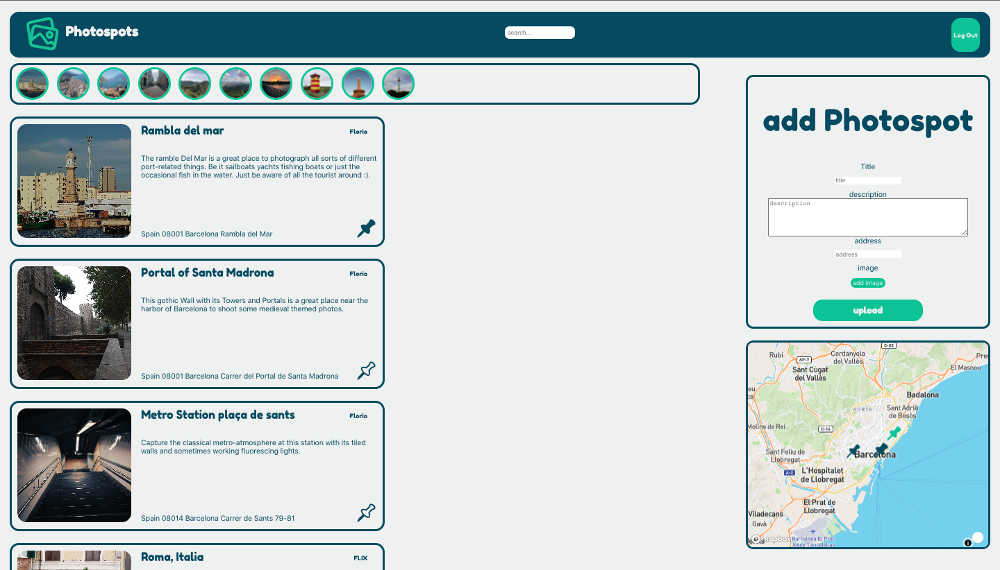

<p align="center">

</p>

# Photospots

share nice places to take photos

<p align="center">

</p>

# Installation

1. Clone this repo!
   
   ```bash
   git clone https://github.com/FlorioPartenzi/Photospots
   cd Photospots
   ```

2. manualy insert the API keys in the .env.example file
   and rename the file into .env (/server) and .env.public (/client)

3. download dependencies
   
   ```bash
   npm i
   ```

4. start the server
   
   ```bash
       cd server
       node index.js
   ```

5. start react
   
   ```bash
     cd ../client
     npm start
   ```

6. see the app running in your browser (http://localhost:3000/)

# Techstack

<p align="left">
<a href="https://developer.mozilla.org/en-US/docs/Web/JavaScript" target="_blank" rel="noreferrer"></a>
<a href="https://developer.mozilla.org/en-US/docs/Glossary/HTML5" target="_blank" rel="noreferrer"></a>
<a href="https://reactjs.org/" target="_blank" rel="noreferrer"></a>
<a href="https://redux.js.org/" target="_blank" rel="noreferrer"></a>
<a href="https://firebase.google.com/" target="_blank" rel="noreferrer"></a>
<a href="https://expressjs.com/" target="_blank" rel="noreferrer"></a>
<a href="https://www.mongodb.com/" target="_blank" rel="noreferrer"></a>
</p>

<h2 align ="center">
  by Florio Partenzi
</h2>
